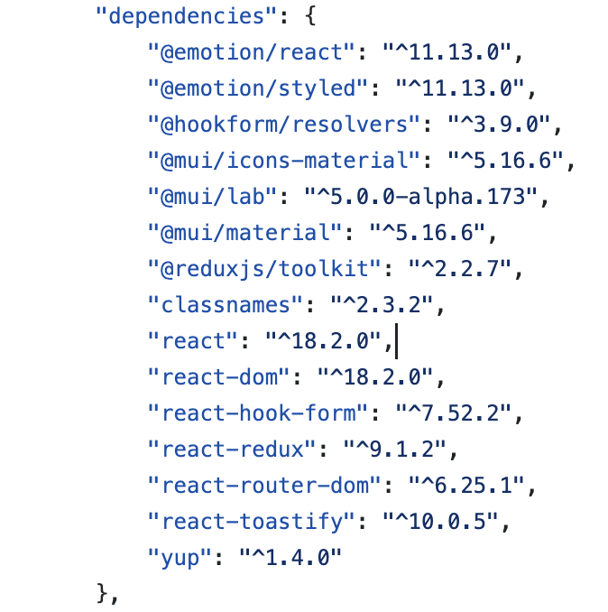
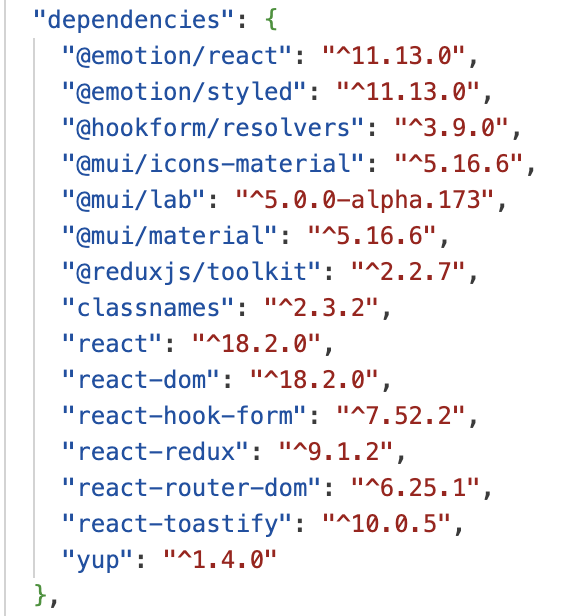
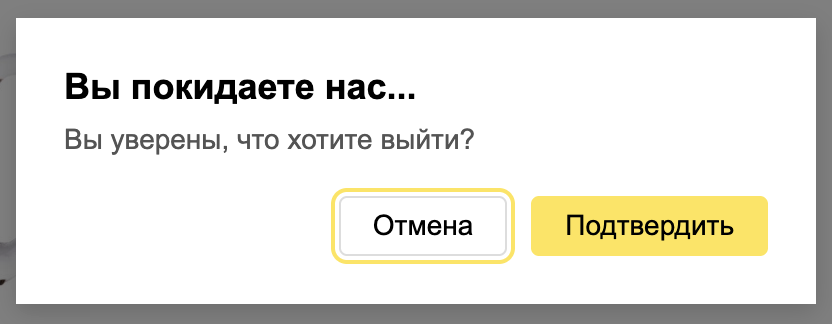
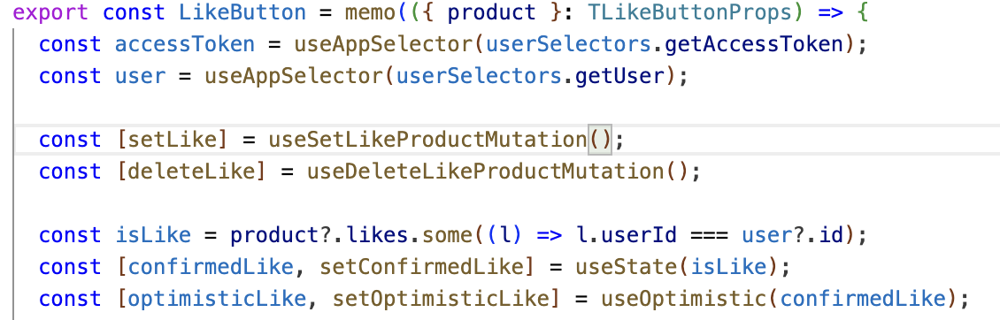
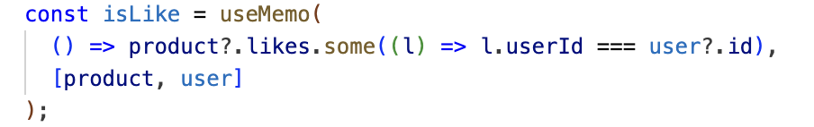
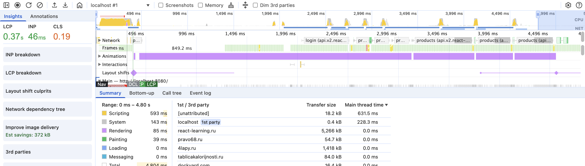
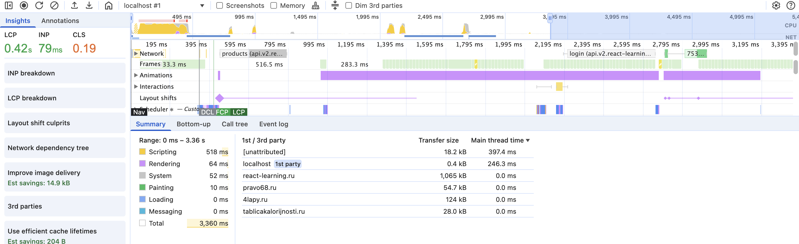

# Итоговый проект

## Установка и запуск

Установка
```
% npm install --legacy-peer-deps
```

Запуск

```
npm run start
```

## Что сделано
1. Обновление библиотек до актуальных версий

Было:


Стало:


2. Портальная модалка (через createPortal) с работающим ESC/overlay.



3. Использование useRef

там же, в п.2

4. Использован useActionState или useOptimistic 

В компоненте LikeButton.



5. Использование React.memo, useMemo




6. Оптимизация производительности

Было:


Стало:



## Чек-лист
### Архитектура и структура

- [ ] В shared/ui лежат только презентационные (UI) компоненты:
- [ ] принимают данные и коллбэки только через props..
- [ ] Фичи изолированы в отдельных папках.
- [ ] Нет глубоких prop-chain’ов без необходимости.

### Оптимизация рендеров

- [x] Использован Profiler — найден hotspot.
- [x] React.memo применяется там, где эффективно.
- [x] useMemo/useCallback оптимизируют сложные вычисления/функции.

### React.Portal для модалок

- [x] Модальное окно работает через портал.
- [x] Закрытие модального окна через клик по иконке крестика, клику вне области модалки и нажатие на клавишу ESC корректно обрабатываются
- [x] Фокус обрабатывается корректно

### useRef — реальное применение

- [x] Пример useRef без рендера.
- [x] Автофокус или другое взаимодействие с DOM.

### Собственные сборки (esbuild/swc)

- [ ] Сборка через esbuild или SWC работает.
- [ ] В README приведено сравнение (размер, время).

### Применение React 19 Hooks

- [x] Использован useActionState или useOptimistic.
- [x] UI реагирует до ответа сервера (оптимистично).
